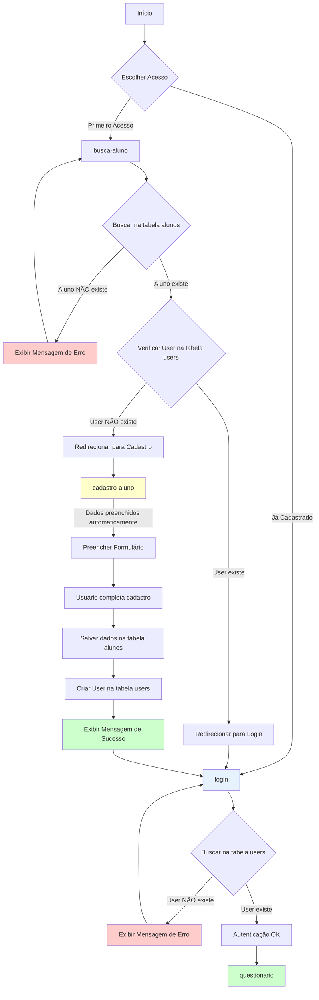

# Fluxo de Navegação do Sistema EGR-App

## Objetivo
Documentar o fluxo de navegação da aplicação Angular 19, baseado na migração do sistema legado (SilverStream).

## Novo Fluxo de Navegação

### Descrição do Fluxo Atualizado

A aplicação possui dois pontos de entrada principais: **Busca de Aluno** e **Login**. Cada um tem seu próprio fluxo de validação.

#### Fluxo Detalhado:

### 🔍 **FLUXO 1: Busca de Aluno (Primeiro Acesso)**

1. **Tela Inicial: Busca de Aluno** (`busca-aluno`)
   - O usuário acessa a tela e preenche os campos de busca
   - Ao submeter a busca, o sistema consulta a tabela `alunos` no `db.json`

2. **Validação e Roteamento na Busca:**
   
   **Cenário 1A: Aluno NÃO encontrado na tabela `alunos`**
   - Exibe mensagem de erro informando que o aluno não existe no sistema
   - Permanece na tela de busca
   
   **Cenário 1B: Aluno encontrado na tabela `alunos` E possui usuário na tabela `users`**
   - Verifica se existe um registro correspondente na tabela `users`
   - Se existe: redireciona para a tela de `login`
   - O aluno já está cadastrado e deve fazer login
   
   **Cenário 1C: Aluno encontrado na tabela `alunos` MAS NÃO possui usuário na tabela `users`**
   - Redireciona para a tela `cadastro-aluno`
   - Preenche automaticamente os campos do formulário com os dados da tabela `alunos`
   - O aluno precisa completar/atualizar seu cadastro

### 🔐 **FLUXO 2: Login (Retorno/Acesso Direto)**

3. **Tela de Login** (`login`)
   - O usuário preenche os campos de login
   - Ao submeter, o sistema consulta a tabela `users` no `db.json`

4. **Validação e Roteamento no Login:**
   
   **Cenário 2A: Usuário NÃO encontrado na tabela `users`**
   - Exibe mensagem de erro informando que o usuário não existe no sistema
   - Permanece na tela de login
   
   **Cenário 2B: Usuário encontrado na tabela `users`**
   - Redireciona diretamente para a feature `questionario`
   - O usuário autenticado pode responder o questionário

### 📝 **FLUXO 3: Cadastro de Aluno**

5. **Tela de Cadastro** (`cadastro-aluno`)
   - Formulário preenchido automaticamente com dados da tabela `alunos`
   - Usuário completa/atualiza as informações necessárias
   - Ao submeter, o sistema:
     - Salva os dados atualizados do aluno na tabela `alunos`
     - **Cria um novo registro na tabela `users`**
     - Exibe mensagem de sucesso
     - Redireciona para a tela de `login`

### Diagrama de Fluxo de Navegação (Mermaid)



## Estrutura de Dados (db.json)

### Tabelas Relevantes:

**1. Tabela `alunos`**
- Contém informações básicas dos ex-alunos
- Campos: id, nome, dataNasc, origemId, cursoId, anoFormado, semestreFormado, email, contatos, endereço, ocupacao, empresa

**2. Tabela `users`**
- Contém os usuários cadastrados no sistema
- Campos: id, nome, numeroAcademico, dataNascimento, cursoId, anoUltimaMatricula, semestreUltimaMatriculaId, turnoId
- Relação: Um aluno pode ou não ter um registro correspondente em `users`

### Lógica de Validação:

```typescript
// ========================================
// FLUXO 1: BUSCA DE ALUNO
// ========================================
async buscarAluno(criteriosBusca) {
  // 1. Buscar na tabela alunos
  const aluno = await buscarNaTabelaAlunos(criteriosBusca);
  
  if (!aluno) {
    // Cenário 1A: Aluno não existe
    exibirMensagemErro('Aluno não encontrado no sistema');
    return;
  }
  
  // 2. Verificar se existe na tabela users
  const user = await buscarNaTabelaUsers(aluno.id);
  
  if (user) {
    // Cenário 1B: Aluno existe e tem user cadastrado
    // Redireciona para login
    navegarPara('/login', { mensagem: 'Por favor, faça login para continuar' });
  } else {
    // Cenário 1C: Aluno existe mas não tem user
    // Redireciona para cadastro com dados preenchidos
    navegarPara('/cadastro-aluno', { alunoId: aluno.id, dadosAluno: aluno });
  }
}

// ========================================
// FLUXO 2: LOGIN
// ========================================
async fazerLogin(credenciais) {
  // 1. Buscar na tabela users
  const user = await buscarNaTabelaUsers(credenciais);
  
  if (!user) {
    // Cenário 2A: User não existe
    exibirMensagemErro('Usuário não encontrado no sistema');
    return;
  }
  
  // Cenário 2B: User existe
  // Autentica e redireciona para questionário
  autenticarUsuario(user);
  navegarPara('/questionario', { userId: user.id });
}

// ========================================
// FLUXO 3: CADASTRO DE ALUNO
// ========================================
async salvarCadastroAluno(dadosFormulario, alunoId) {
  try {
    // 1. Atualizar dados na tabela alunos (se necessário)
    await atualizarAluno(alunoId, dadosFormulario);
    
    // 2. Criar novo registro na tabela users
    const novoUser = {
      nome: dadosFormulario.nome,
      numeroAcademico: dadosFormulario.numeroAcademico,
      dataNascimento: dadosFormulario.dataNascimento,
      cursoId: dadosFormulario.cursoId,
      anoUltimaMatricula: dadosFormulario.anoUltimaMatricula,
      semestreUltimaMatriculaId: dadosFormulario.semestreUltimaMatriculaId,
      turnoId: dadosFormulario.turnoId
    };
    
    await criarUser(novoUser);
    
    // 3. Exibir mensagem de sucesso
    exibirMensagemSucesso('Cadastro realizado com sucesso!');
    
    // 4. Redirecionar para login
    navegarPara('/login', { mensagem: 'Por favor, faça login para acessar o questionário' });
    
  } catch (error) {
    exibirMensagemErro('Erro ao salvar cadastro. Tente novamente.');
  }
}
```

## Código Proposto (Angular Routes - `app.routes.ts`)

Com base no novo fluxo de navegação:

```typescript
import { Routes } from '@angular/router';
import { authGuard } from './core/guards/auth.guard';

export const routes: Routes = [
  {
    path: '',
    loadComponent: () =>
      import('./layout/layout.component').then((m) => m.LayoutComponent),
    children: [
      {
        path: '',
        redirectTo: 'busca-aluno',
        pathMatch: 'full',
      },
      {
        path: 'busca-aluno',
        loadComponent: () =>
          import('./features/aluno/busca-aluno/busca-aluno.component').then(
            (m) => m.BuscaAlunoComponent
          ),
      },
      {
        path: 'login',
        loadComponent: () =>
          import('./features/auth/login/login.component').then(
            (m) => m.LoginComponent
          ),
      },
      {
        path: 'cadastro-aluno',
        loadComponent: () =>
          import('./features/aluno/cadastro-aluno/cadastro-aluno.component').then(
            (m) => m.CadastroAlunoComponent
          ),
      },
      {
        path: 'questionario',
        loadComponent: () =>
          import('./features/questionario/questionario.component').then(
            (m) => m.QuestionarioComponent
          ),
        canActivate: [authGuard], // Protege a rota - apenas usuários autenticados
      },
    ],
  },
  {
    path: '**',
    redirectTo: 'busca-aluno',
  },
];
```

## Checklist de Implementação

### Features de Aluno:
- [x] Criar componente `BuscaAlunoComponent`
  - [ ] Implementar formulário de busca
  - [ ] Implementar lógica de validação na tabela `alunos`
  - [ ] Implementar verificação na tabela `users`
  - [ ] Implementar roteamento para `login` se user existe
  - [ ] Implementar roteamento para `cadastro-aluno` se user não existe
  - [ ] Implementar exibição de mensagens de erro

- [x] Criar componente `CadastroAlunoComponent`
  - [ ] Implementar formulário de cadastro
  - [ ] Implementar preenchimento automático com dados do aluno
  - [ ] Implementar atualização na tabela `alunos`
  - [ ] **Implementar criação de registro na tabela `users`**
  - [ ] Implementar exibição de mensagem de sucesso
  - [ ] **Implementar redirecionamento para `login` após cadastro**

### Features de Autenticação:
- [ ] Criar componente `LoginComponent`
  - [ ] Implementar formulário de login
  - [ ] Implementar validação na tabela `users`
  - [ ] Implementar exibição de mensagens de erro (usuário não encontrado)
  - [ ] Implementar autenticação do usuário
  - [ ] Implementar redirecionamento para `questionario` após login
  - [ ] Implementar suporte para mensagens de contexto (ex: "Cadastro realizado com sucesso")

### Features de Questionário:
- [ ] Criar componente `QuestionarioComponent`
  - [ ] Implementar exibição do questionário
  - [ ] Implementar lógica de resposta
  - [ ] Implementar salvamento das respostas
  - [ ] Proteger acesso apenas para usuários autenticados

### Serviços:
- [ ] Criar `AlunoService`
  - [ ] Método `buscarAluno(criterios)` - busca na tabela alunos
  - [ ] Método `verificarUser(alunoId)` - verifica na tabela users
  - [ ] Método `atualizarAluno(id, dados)` - atualiza dados do aluno

- [ ] Criar `AuthService`
  - [ ] Método `login(credenciais)` - busca e valida na tabela users
  - [ ] Método `criarUser(dados)` - cria novo registro na tabela users
  - [ ] Método `autenticarUsuario(user)` - gerencia sessão do usuário
  - [ ] Método `verificarAutenticacao()` - verifica se usuário está logado
  - [ ] Método `logout()` - encerra sessão do usuário

- [ ] Criar `QuestionarioService`
  - [ ] Método `obterQuestionario()` - busca questionário
  - [ ] Método `salvarRespostas(respostas)` - salva respostas

### Guards:
- [ ] Criar `AuthGuard`
  - [ ] Implementar verificação de autenticação
  - [ ] Redirecionar para login se não autenticado
  - [ ] Proteger rota do questionário

### Configuração:
- [x] Configurar rotas em `app.routes.ts`
- [ ] Configurar rota padrão para `busca-aluno`
- [ ] Adicionar guard de autenticação na rota `questionario`
- [ ] Implementar sistema de mensagens (toast/alert)
- [ ] Testar todos os cenários de navegação
- [ ] Implementar tratamento de erros HTTP
- [ ] Adicionar loading states durante as buscas

## Observações Importantes

1. **Dois Pontos de Entrada**: 
   - `busca-aluno` para primeiro acesso/cadastro
   - `login` para usuários já cadastrados

2. **Validação em Duas Etapas na Busca**: 
   - Primeiro verifica na tabela `alunos`
   - Depois verifica na tabela `users` para decidir o próximo passo

3. **Fluxo de Cadastro Completo**:
   - Preenche dados automaticamente da tabela `alunos`
   - Salva/atualiza dados na tabela `alunos`
   - **Cria novo registro na tabela `users`**
   - Exibe mensagem de sucesso
   - Redireciona para `login`

4. **Autenticação Necessária**: 
   - Apenas usuários que fizeram login podem acessar o questionário
   - Guard protege a rota do questionário

5. **Sincronização de Dados**: 
   - Tabela `alunos`: dados completos do ex-aluno
   - Tabela `users`: credenciais e dados essenciais para login
   - Relacionamento: 1 aluno pode ter 0 ou 1 user
